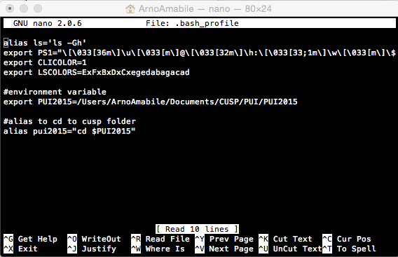
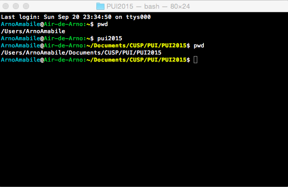

# PUI2015_aamabile

## First step setting up environment
I created the folder PUI2015 on gitHub then on my desktop and pushed the following screenshot.

I also added this screenshot of my terminal and modified the README file within the terminal

