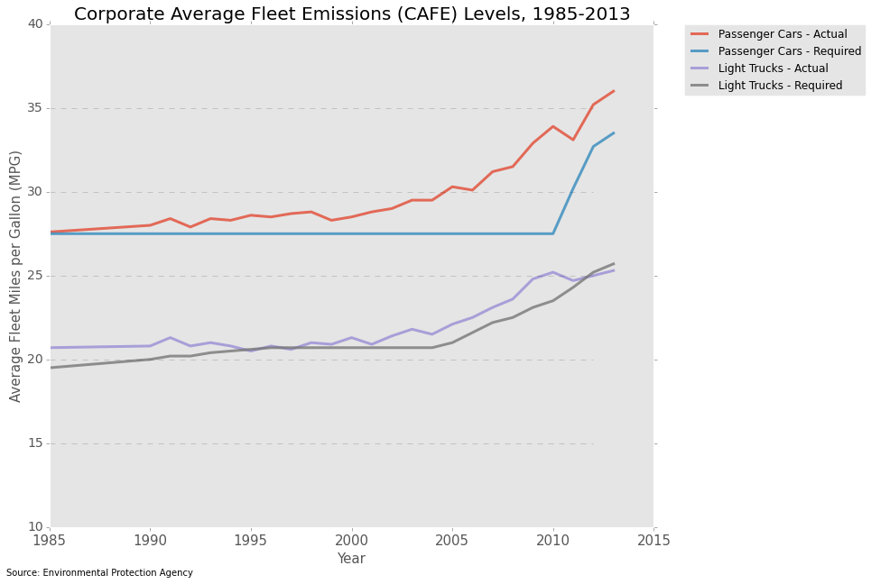

# Homework 8 - Review 2
## Plot reviewed: dq33 DQOfficial
## Author: Arno Amabile

### CLARITY
The aim of the plot is clear (comparison between actual and required fleet emissions, over the years). The context is however non obvious for an outsider to the EPA regulation. How strict are the requirements? Especially as it seems that the Corporate Average Fleet Emissions for Light Trucks are below the requirements since 2012.

### ESTHETIC
The esthetic of the plot carries the analysis (comparison between actual and required trends) efficientlly. A small drawback is that, as all lines have a different colors, it takes a look at the legend to understand that the lines are only comparable within the same category.

### HONESTY
The plot seems honest.

### IMPROVEMENTS
To better group mentally the actual & required trends, it could be better to plot the lines of each category (passenger cars & light trucks) with the same color, with the actual trend being a full line, and the required a dashed line. And maybe add a caption describing the context of the plot.