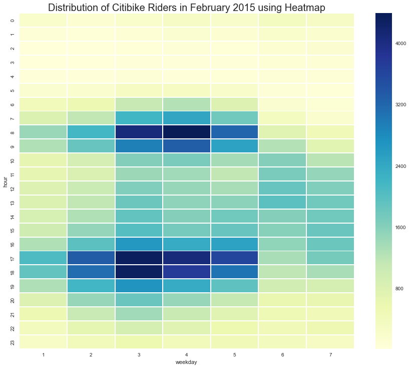

# Homework 8 - Review 3
## Reviewed plot: yz3204 kikyoianina
## Author: Arno Amabile

### CLARITY
The Readme file provides a very clear description of what the plot represents. It gives a rapid and clear view of the intensity of Citibike ridership across both days of the week and hours of the days.

### ESTHETIC
The colors are appropriately chosen, as a deep color is often associated with a higher value. They enable to visualize easily the peak hours during the week.

### HONESTY
The plot seems honest.

### IMPROVEMENTS
The only possible improvements I can think of concerns the x axis, which could have labels with the name of the days instead of their number, although the numbers are given in the Readme file.