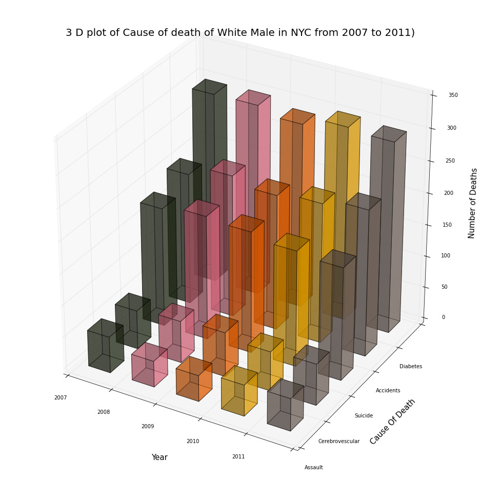

# Homework 8 - Review 1
## Plot reviewed: ssp501 svarmit
## Author: Arno Amabile

### CLARITY
The aim of the plot is clear, but there are two drawbacks:
* The labels of the ticks on the "Cause of Death" axis are shifted, so that it seems on\
a quick glance that the category on the front is Cerebrovascular and not Assault.
* It is difficult to accurately estimate the values, even more for those farther from\
the vertical axis. It is unclear whether, in 2007, the number of death from Assault is\
bigger or smaller than the number of deaths from Cerebrovascular attacks.

### ESTHETIC
The colors distinguish clearly between the different years, but they push the viewer to\
look only at the comparison between the causes of death in a given year, and not their\
evolution over the years. 

### HONESTY
The plot seems honest.

### IMPROVEMENTS
A line plot of the number of death vs. year, by cause of death would have maybe been\
more easily readable. It would have enabled both a rapid comparison of causes of death\
in a given year, and a clear view of the time trends.